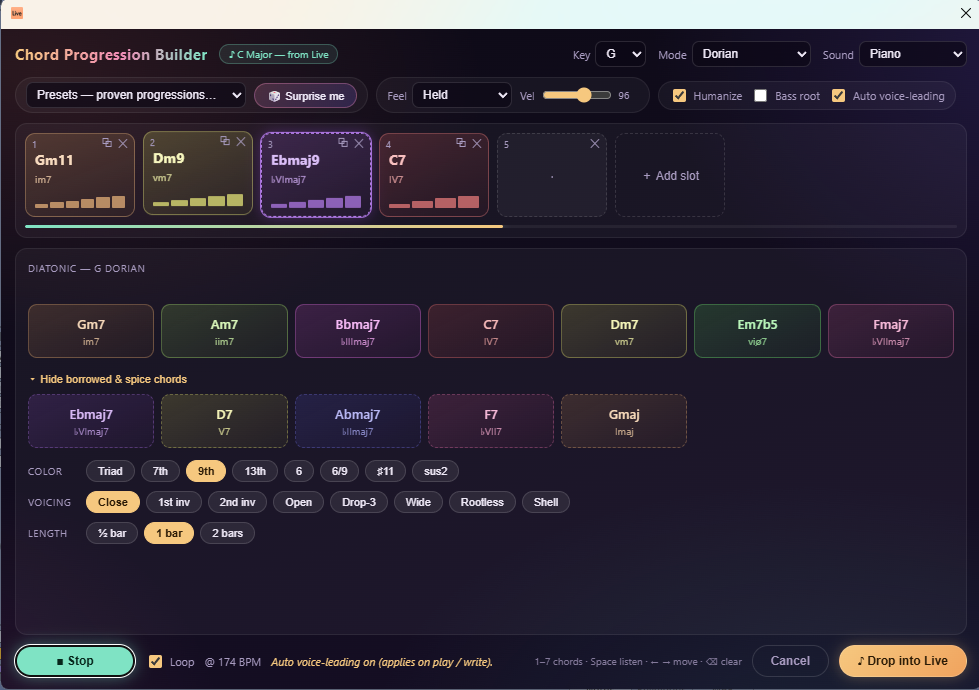
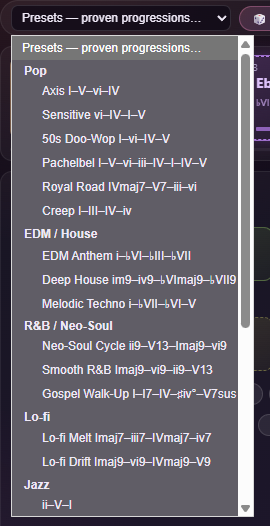
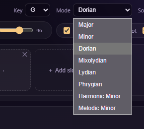
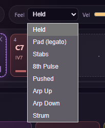
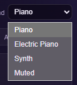

# Chord Progression Builder

A context-menu extension for **Ableton Live 12** that lets you build, audition, and
write chord progressions straight into a MIDI clip — without leaving Live or knowing
any music theory.

Right-click a MIDI track → **Build Chord Progression…**, and a dialog opens pre-tuned
to your Live Set's key and scale. Pick chords, color them with extensions, shape the
voicings and rhythm, hear it play back at your project tempo, then write it to a looped
clip with one click.



## Features

- **Opens in your key.** The dialog reads your Live Set's root note and scale on open,
  so every chord suggestion is already in key. You can also manually update the key.
- **8 modes** — Major, Minor, Dorian, Mixolydian, Lydian, Phrygian, Harmonic Minor,
  and Melodic Minor — with diatonic chords *and* curated borrowed chords for each.
- **🎲 Surprise me** — roll a musically-sensible 4-chord progression instantly.
- **30+ genre presets** — Pop, EDM / House, R&B / Neo-Soul, Lo-fi, Jazz, Trap / Dark,
  Classic, and Cinematic. (Axis, Doo-Wop, Royal Road, Neo-Soul Cycle, ii–V–I,
  Andalusian, 12-Bar Blues, and more.)
- **Chord colors** — add 9ths, 13ths, sus, and other extensions per chord.
- **Voicings** — Close, Open (drop-2), Drop-3, Wide, plus Rootless and Shell for
  seventh chords, with optional **auto voice-leading** that picks the smoothest
  inversion against the previous chord.
- **Rhythm engine** — Held, Pad (legato), Stabs, 8th Pulse, Pushed, Arp Up/Down,
  and Strum patterns, with an optional **Humanize** pass.
- **Built-in preview** — audition the whole progression, tempo-synced, with Piano,
  Electric Piano, or Synth sounds and a sweeping playhead.
- **One-click write** — drops a single looped MIDI clip into the first empty slot
  (and adds a scene if the track is full, so the write never fails).

## Screenshots

| | |
|---|---|
| **30+ genre presets** | **Opens in your Set's key & 8 modes** |
|  |  |
| **8 rhythm patterns** | **Preview sounds** |
|  |  |

## Requirements

- **Ableton Live Suite 12.4.5 or newer** (Extensions require Live Suite).

## Install

1. Download `Chord-Progression-Builder-1.0.0.ablx`.
2. In Live, open **Preferences → Extensions**.
3. Drag the `.ablx` file into the Extensions list (or use the install button).
4. Right-click any **MIDI track** and choose **Build Chord Progression…**.

> Note: Extensions are a Live Suite feature. The first time you install a
> community extension you may need to confirm the install in Live's dialog.

## How to use

1. Right-click a MIDI track → **Build Chord Progression…**.
2. (Optional) Pick a **genre preset** or hit **🎲 Surprise me** for a starting point.
3. Click slots to place chords; tweak **color**, **voicing**, and **bars** per slot.
4. Choose a **Sound** and **rhythm pattern**, toggle **Humanize**, and press play to
   audition at your project tempo.
5. Click **Write to Live** — the progression lands as a looped MIDI clip on the track.

## Building from source

Requires Node ≥ 22.11.

```bash
npm install
npm run build       # type-check + production bundle
npm run package     # builds, then produces the distributable .ablx
npm run start       # build:dev + launch in Live (needs Live running + EXTENSION_HOST_PATH in .env)
```

## Credits

Built by **hello_nocap** with the
[`@ableton-extensions/sdk`](https://www.ableton.com/) and the
[`tonal`](https://github.com/tonaljs/tonal) music-theory library.

## License

Released under the [MIT License](LICENSE) © 2026 hello_nocap.
