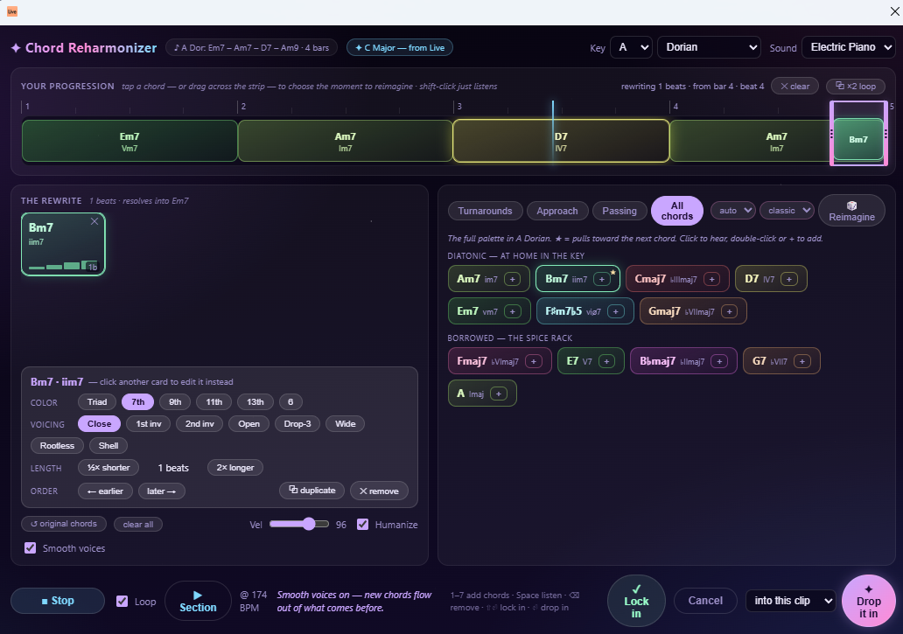
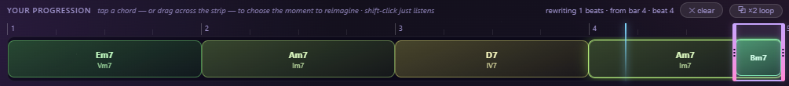
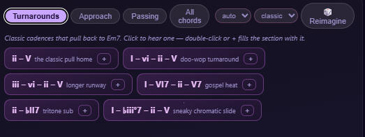
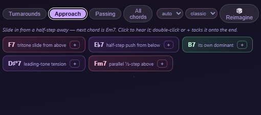
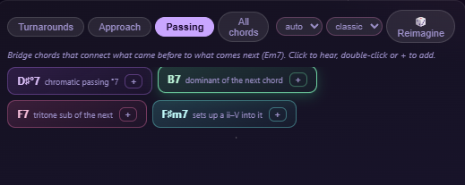
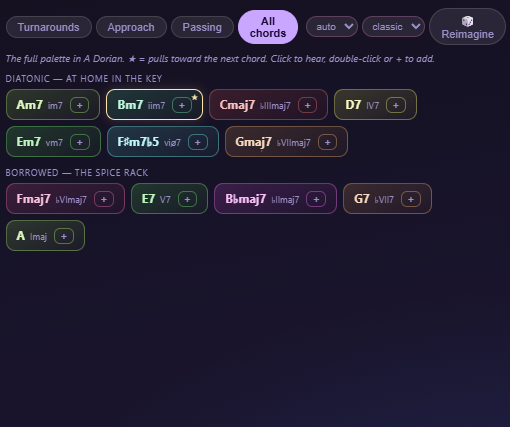
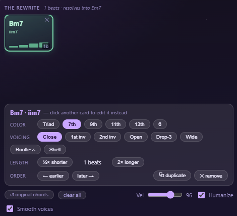
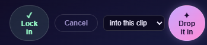

# Chord Reharmonizer

A context-menu extension for **Ableton Live 12** that reharmonizes the chord
progressions you've already got — right in your clips, without hand-editing MIDI.

Right-click a MIDI clip → **Reharmonize Section…**, and a dialog reads the clip
into chord blocks on a timeline. Select a section, then add a **turnaround**,
**chromatic approach chord**, or **passing chords** — or place any chord in the key
by hand — auditioning everything in context at your project tempo before you drop it
in. Where [Chord Progression Builder](../chord_progression_builder/) *writes* a new
progression from scratch, Chord Reharmonizer *transforms an existing one.*



## Features

- **Reads your clip into chords.** The extension analyzes the MIDI clip into chord
  blocks laid out on a bar/beat timeline, colored by a circle-of-fifths hue wheel so
  harmonically close chords get visually close colors.
- **Opens in your key.** It snapshots your Live Set's root + scale on open, so every
  suggestion is already in key. Override the key/mode at any time without losing your edits.
- **Select any section** — click a chord block (you hear its real notes) or drag across
  the timeline. Shift-click a block to just audition it without touching the selection.
  Edge handles and a draggable middle fine-tune the span, with a live
  `rewriting N beats · from bar X` readout.
- **Context-aware reharmonization techniques** — each reads the chord that *follows* your
  selection and offers musically correct options:
  - **Turnarounds** — cadential templates that lead back to the next chord (`ii–V`,
    `I–vi–ii–V`, `iii–vi–ii–V`, secondary-dominant, tritone-sub, and passing-diminished).
  - **Approach** — a chord placed right before the next one (tritone sub, half-step below,
    secondary dominant, leading-tone °7, parallel half-step).
  - **Passing** — a chord that bridges the preceding and following chords.
  - **All chords** — every diatonic and borrowed chord in the key; the ones that pull
    toward the next chord are ★ starred.
  - **🎲 Reimagine** — rolls a progression that *resolves into whatever follows the
    selection*: chords are generated backward from the next chord (dominants, ii–Vs,
    tritone subs, leading-tone °7s, borrowed colors) and auto-played. Pick **how many
    chords** (auto / 1–6 — auto fits the selection length) and a **vibe** — *subtle*
    never leaves the key, *classic* adds secondary dominants and stock turnarounds,
    *spicy* raids the spice rack. **📌 Pin** the cards you like and reroll: pinned
    chords survive untouched and rerolled ones keep their rhythm, so a roll converges
    instead of starting over.
- **Audition before you commit.** Suggestion chips *play* on a single click; a second
  click (or the **+** button) commits them. Tapping a timeline block, a rewrite card, or
  a palette chip plays it instantly.
- **▶ Listen** plays the whole progression — your rewrite in context, original notes
  around it — tempo-synced with a sweeping playhead and a **Loop** toggle that picks up
  edits on the next pass. **▶ Section** auditions just the rewrite and the chord it
  resolves into.
- **Chord colors & voicings (CPB parity).** Per-chord extensions (9ths, 13ths, sus,
  altered tensions) and voicings (Close, inversions, Open/drop-2, Drop-3, Wide, Rootless,
  Shell) — recomputed from the canonical chord so transforms never compound.
- **Sits in the part.** New chords are **register-anchored** to the original material's
  range instead of jumping to middle C. Optional **Smooth voices** voice-leads from the
  notes just before the selection, plus a **Velocity** slider and **Humanize** toggle.
- **Multi-section editing.** **✓ Lock in** bakes the current section and frees the
  selection for the next one — reharmonize several spots in a single pass, with a
  32-deep **↩ undo** history.
- **Write where you want.** Apply **into this clip** (rewrites in place as one undo step,
  works for session *and* arrangement clips) or **as a new clip** (`"<original> (reharm)"`
  in the next empty session slot). Applying slices the original notes at the selection
  boundaries, so a chord ringing past the edge keeps its tail.

## Screenshots

**Your progression on a bar/beat timeline — click or drag to pick the section to reharmonize:**



Context-aware technique tabs — each reads the chord that *follows* your selection:

| | |
|---|---|
| **Turnarounds** | **Approach** |
|  |  |
| **Passing chords** | **Every chord in the key (★ pulls to the next)** |
|  |  |

| | |
|---|---|
| **Per-card color, voicing, length & order** | **Audition: ▶ Listen / Loop / ▶ Section** |
|  |  |

**✓ Lock in** the current section to commit it and keep reharmonizing more spots in the same pass — then drop the whole rewrite into the source clip or a new one:



## Requirements

- **Ableton Live Suite 12.4.5 or newer** (Extensions require Live Suite).

## Install

1. Download `Chord-Reharmonizer-1.0.0.ablx` from the
   [**Releases page**](https://github.com/notacap/ableton-extensions/releases).
2. In Live, open **Preferences → Extensions**.
3. Drag the `.ablx` file into the Extensions list (or use the install button).
4. Right-click any **MIDI clip** and choose **Reharmonize Section…**.

> Note: Extensions are a Live Suite feature. The first time you install a
> community extension you may need to confirm the install in Live's dialog.

## How to use

1. Right-click a MIDI clip → **Reharmonize Section…**.
2. **Select a section** of the progression — click a chord block or drag across the
   timeline (shift-click a block to audition it without changing the selection).
3. Add a **turnaround / approach / passing** chord from the technique tabs, place chords
   by hand from the key palette, or hit **🎲 Reimagine** (set the chord count + vibe next
   to the dice, 📌 pin keepers between rolls). Single-click a chip to hear it, click again
   (or **+**) to commit.
4. Shape each card's **color**, **voicing**, length, and order; toggle **Smooth voices**
   and **Humanize**; press **▶ Listen** to audition at your project tempo.
5. (Optional) **✓ Lock in** the section and move on to another spot in the clip.
6. Pick a destination and hit **✦ Drop it in** — the rewrite lands in your clip.

## Building from source

Requires Node ≥ 22.11.

```bash
npm install
npm run build       # type-check + production bundle
npm run package     # builds, then produces the distributable .ablx
npm run start       # build:dev + launch in Live (needs Live running + EXTENSION_HOST_PATH in .env)
```

## How it works

The extension stays a thin reader/writer: it reads the clip + key once at open time and
applies the final rewrite once. *All* analysis, editing, and rendering happen client-side
in the dialog webview (which carries its own self-contained chord-detection and
close-voicing engine — no `tonal` in the browser), with no round-trips in between.

- **`src/extension.ts`** — SDK activation, the `tonal`-based chord palette (diatonic +
  curated borrowed chords per mode), the clip/key snapshot, and `writeReharmonizedClip`
  (in-place / new-clip apply). Registers `crh.open` on the `MidiClip` context-menu scope.
- **`src/dialog.html`** — the entire UI and engine: clip→chord-block analysis, the
  timeline + selection state-machine, the ghost-preview renderer, the technique
  generators, register anchoring + auto voice-leading, the Web Audio instruments + loop
  transport, and the postMessage bridge.

## Known limitations

- **Assumes 4/4** — the SDK doesn't expose the clip's time signature, so the bar grid is
  fixed at 4 beats/bar.
- **Chord-block detection is heuristic** — tuned for root-position block chords; dense or
  arpeggiated clips may over-segment (the drag-select fallback covers those cases).
- **Block-chord output** — inserted chords are sustained blocks; they don't yet match the
  source clip's rhythm or per-chord velocity.
- **"As a new clip" writes to a session slot** — for arrangement clips, use the default
  in-place mode (which fully supports them).

## Credits

Built by **hello_nocap** with the
[`@ableton-extensions/sdk`](https://www.ableton.com/) and the
[`tonal`](https://github.com/tonaljs/tonal) music-theory library.

## License

Released under the [MIT License](LICENSE) © 2026 hello_nocap.
